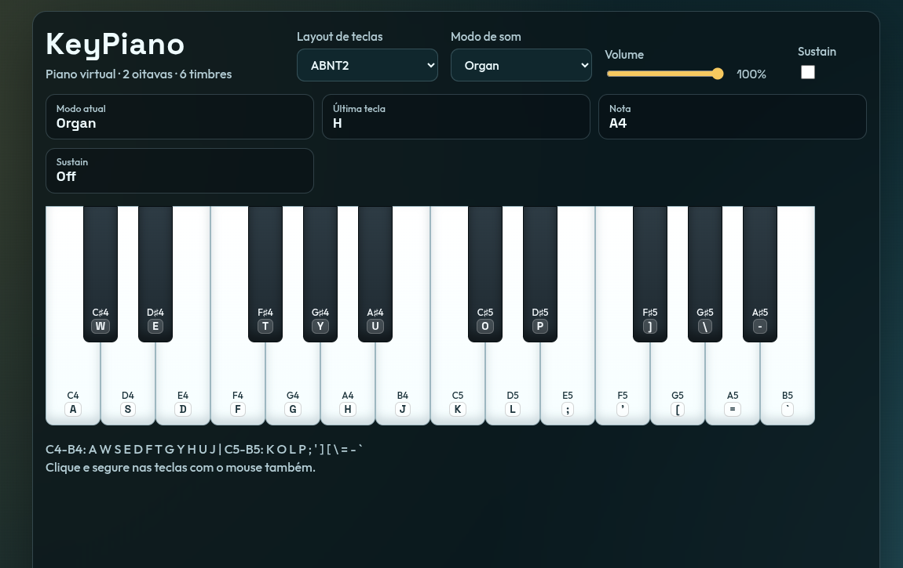

# KeyPiano



Virtual piano with 2 octaves, multiple sound modes, customizable keyboard layout, master volume, and sustain pedal.

## Features

- 2 full octaves (C4 to B5)
- 6 timbre modes: Piano, Organ, Synth, Bell, Bass, Flute
- Keyboard layout presets: ABNT2 and US
- Master volume slider
- Sustain toggle (virtual pedal)
- Mouse, physical keyboard, and focused-keyboard (Enter/Space) support
- Preferences persistence using localStorage (mode, layout, volume, sustain)

## Tech Stack

- HTML5
- CSS3
- JavaScript (ES Modules)
- Web Audio API

## Project Structure

```text
.
├── index.html
├── styles.css
├── presentation.png
└── js
	├── app.js
	├── keyboard.js
	└── piano.js
```

## Run Locally

Because this project uses ES Modules, run it with a local server.

### Option 1: Python

```bash
python3 -m http.server 8000
```

Open:

```text
http://localhost:8000
```

### Option 2: VS Code Live Server

Open the project folder and start Live Server from VS Code.

## Controls

- Play notes: keyboard, click, or focus a key and press Enter/Space
- Change timbre: Modo de som selector
- Change layout preset: Layout de teclas selector
- Adjust volume: Volume slider
- Toggle sustain: Sustain switch

## Accessibility

- Piano keys are focusable
- Focus-visible styles for controls and keys
- ARIA labels and pressed state updates on piano keys

## License

This project is available for personal and educational use.
